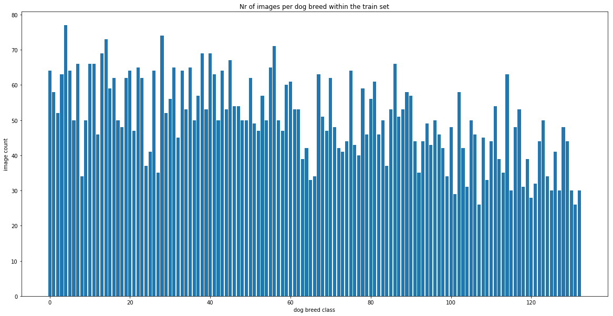

# Dog Breed Classification Webapp

### Project Definition
This webapp is part of the Capstone project for the Udacity Data 
Scientist Nanodegree program. The goal of this project is to classify images of dogs according to their breed. 
If a human is detected the code should provide an estimate of the dog breed that is most resembling. 

Success will be measured by the accuracy of predicting the correct dog breed for the given image.
This webapp uses the Flask framework to deploy a trained model based on ResNet50 
that is used to classify dog breeds in images. If you'd upload images of humans 
to the app it should recognise them as humans and give you the dog breed that 
resembles these humans most. 
 
The corresponding Jupyter notebook where the model has been built can 
be found here: [https://github.com/skalizzo/Dog_Breed_Classification](https://github.com/skalizzo/Dog_Breed_Classification)

### Technologies used
<li>Python 3.7</li>
<li>Flask 1.1.1</li>
<li>Jinja2 2.10.3</li>
<li>Werkzeug 0.16.0</li>
<li>Keras 2.2.5</li>
<li>tensorflow 2.0.0 </li>
<li>OpenCV 4.1.2.30</li>
<li>numpy 1.16.1</li>

### Installation/Usage
1. Clone this repository
2. Install the required packages (see above)
3. Run with Python: $ python app.py
4. Open browser at http://localhost:5000, select an image on your computer 
and start the prediction using the "Predict Dog Breed" button

If you want to modify the UI you can modify the files in the templates directory.

### Analysis
Udacity has provided 8351 labeled dog images and 13233 images of humans to train the algorithm. There are 133 possible 
dog breeds that can be predicted. The classes in the training dataset are a little unbalanced. The dog breed with the 
lowest image count has 26 images while the dog breed with the highest image count has 77 images.

Here you can see the distribution of the train set:

### Methodology / Results
I've followed the following steps to create the algorithm:

* Step 0: Import Datasets  
The 3 dog data sets for training, testing and validation are imported as numpy arrays.

* Step 1: Build a face detector for humans 
After I've imported the dataset I've implemented a face detecting algorithm based on OpenCV's 
implementation of Haar-based classifiers. It returns True if a human face is detected within the image.
Within a test using 100 sample human images and 100 sample dog images the face detector classified
 100% of the human images correctly which is great but it also classifies 11% of the dog images 
 wrongly as humans. That is not a great performance but it is ok.

* Step 2: Build a detector for dogs 
I then implemented an alghorithm to determine wether the image has a dog in it or not. To do that the image 
has to be preprocessed first (rescaling it and transforming it into a 4D tensor). Then the Resnet50 model 
(trained on the ImageNet database) is used to do the prediction. This algorithm works perfectly well as it 
classified 100% of the dog images as dogs and 0% of the humans as dogs.

* Step 3: Create a CNN to Classify Dog Breeds (from Scratch)  
First i've tried to create a convolutional neural network from scratch using the keras library.   
I've used a combination of Convolutional Layers and (local) Pooling Layers followed by a GlobalAveragePooling Layer 
plus the output Dense layer at the end. The Convolutional Layers are there to extract features from the image. 
The Pooling layers then reduce the complexity to prevent overfitting. They also take out the spatial information 
so that at the end only the information about the content remains. I've then included a GlobalAveragePooling Layer 
to take out more complexity. I've experimented with including a hidden Dense layer with 1000 nodes and a "relu" 
activation function before the final output layer but it didn't really make a big difference in train accuracy. 
In fact it did rather drive down the accuracy of the test set predictions so I've removed it from the model. 
The final Dense layer hass 133 nodes as this is the number of (dog-) classes that should be predicted. 
The activation function has to be softmax as we want to have probabilities for our predictions.
As we are making categorical predictions the loss function of the optimizer has to be "categorical_crossentropy". 
"rmsprop" is a good optimizer for classification tasks.   
After training the model for 10 epochs it achieved a test accuracy of almost 4%. This could surely be improved by 
using more epochs for our training or getting (a lot) more images for training but it is better than random guessing.

* Step 4: Use a CNN to Classify Dog Breeds (using Transfer Learning)  
In this step I've used transfer learning to use the VGG-16 model pretrained on the ImageNet dataset without the 
final dense layers. The layers of the imported model have been frozen so the model can be used as input for our own model.
This model achieved a test accuracy of about 43%.

* Step 5: Create a CNN to Classify Dog Breeds (using Transfer Learning)  
In this step I've tried another pre-trained model - the ResNet50 model also pretrained on the ImageNet dataset. 
We don't want to train the weights of the pretrained model again as they've been trained before on a large dataset 
and achieve good results. As we have a small dataset with images that have some similarities with the ImageNet images 
(large dataset) the best solution is to cut off the final dense layers of the pretrained model and only take 
the preceding layers/weights. So we would only have to include a final Dense layer with the number of classes 
(133 dog breeds) that we want to predict as the number of nodes. The activation function has to be softmax as 
we want to have probabilities as an output. I've also added a GlobalAveragePoolingLayer before the final 
(fully connected) Dense layer to prevent overfitting and to reduce dimensionality, another hidden fully connected 
layer to extract some more features of our specific dataset and a dropout layer that randomly cuts off some 
nodes to prevent overfitting.  
With this model I've been able to achieve a test accuracy of almost 77%. 

* Step 6: Write the Algorithm  
In the final stage I've put everything together and created a DogBreedPredictor class including all preprocessing steps
as well as the face detector and dog detector and of course the final predicition model based on ResNet50. The class 
prints out the predictions along with the corresponding image via the "predictDogBreed" method.

* Step 7: Test the Algorithm  
I've then tested the performance of the model by feeding it with some images that I've downloaded from the internet.   
I think the output is quite good. Most predictions have been correct although it mistakenly predicted a pug as a 
bulldog but that's a hard one even for humans. Helge Schneider (a famous and weird comedian here in Germany) hasn't 
been identified as a human which is probably caused by the amount of hair in his face. To improve the accuracy we 
could try to augment the data with modified versions of the pictures we used to train. We could also use another 
pre-trained model or we could try to edit the parameters or the design of our model. Also we could get more data by 
looking for dog images on the internet, labeling them and retraining the model.

* Step 8: Deploying the model to production  
I've chosen to deploy the model to production using a Flask webapp. The user has the ability to upload images via 
this app and to start the prediction. 
This has been really difficult as I've experienced a lot of problems related to the way Flask uses multiple 
threads to do its work. This often collides with the way tensorflow works. After a painful journey I've found out 
that you have to make sure that every step of the predictive process has to occur within the same Tensorflow session 
and graph. It is also good to know that the new ResNet50 version has a different output format so I've had to redimnsion 
the bottleneck features to still fit my model. Also I've noticed that you need some Javascript knowledge to really 
build a good and useful webapp. 

### Conclusion
Implementing the model on our own and training it using our small dataset only reached around 4% accuracy which is 
really bad. Transfer Learning proved to be really useful as we could then reach an accuracy of almost 77%. I guess you 
could also be able to reach an even better performance if you'd use another (larger) pre-trained model like Xception 
or maybe you also could experiment more with the architecture of the final layers.
The webapp works fine as it is but there is also room for improvement. You could use the power of cloud computing to 
speed up the prediction process and you could also include more than one prediction if the algorithm isn't too sure 
about its output. Also you could implement the ability to predict multiple images at once.

As a final remark I can say that this has really been a fun project and that I've learned a lot about deep learning 
techniques and also about the Flask web framework.